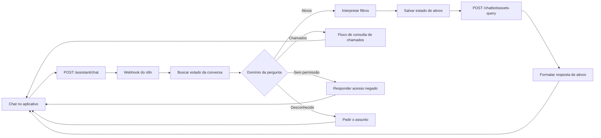

# Consulta de ativos no chat

O chat consulta a Central de Ativos pelo workflow ativo do n8n. A consulta cobre os inventários de **climatização, incêndio e água**. Perguntas sobre chamados continuam no fluxo anterior.

## Perguntas atendidas

- Totais: “Quantos ativos de climatização existem?”
- Listagens: “Liste 5 extintores da praça Natal.”
- Agrupamentos: “Quantos equipamentos existem por tipo?” ou “Quais as localizações dos ativos?”
- Rankings: “Quais lojas têm mais ativos de climatização?”
- Filtros: tipo de ativo, loja, praça, status, tipo de equipamento, local, marca, código, BPCS, SAP, capacidade em BTU e vencimento/troca de filtro até uma data.
- Continuação: “E na praça Natal?” ou “Quantos são no salão de venda?” mantém os filtros pertinentes da pergunta anterior.

Em perguntas de continuação, o n8n mescla apenas os filtros alterados; perguntas novas substituem o estado. Assim o modelo recebe a pergunta atual e um estado curto, sem o histórico inteiro no prompt. O roteamento normaliza os termos antes de decidir: “ar condicionados” e “máquinas de ar condicionado” são perguntas de ativos, e “chamados” sem qualificador é corretiva. Onde esse estado vive está na seção **Estado da conversa**, abaixo.

No inventário, “salão de venda” corresponde aos locais cadastrados como “Salão” ou “Salão de Vendas”. Uma resposta de contagem com esse filtro informa os nomes dos locais efetivamente encontrados. Perguntas sobre **quais são as localizações** agrupam os ativos por local e removem o filtro anterior de local, preservando loja e tipo.

A listagem devolve no máximo 50 equipamentos por resposta. Agrupamentos e rankings devolvem no máximo 100 grupos. A API retorna o total e sinaliza quando houve corte. A consulta não aceita SQL livre nem modifica os cadastros.

## Autorização

O usuário precisa de `assistant.use` para falar no chat. Cada domínio exige a sua permissão: `assets.view` para ativos, `indicators.view` para chamados corretivos, preventivos e custos. O backend emite um comprovante assinado, válido por três minutos, **listando os domínios autorizados**; o n8n o encaminha à API usando a credencial `X-Internal-API-Key` já existente. Uma pergunta de domínio não autorizado recebe resposta de falta de permissão nomeando o domínio recusado.

Como os domínios entram no corpo assinado, adulterar a lista quebra o HMAC. Um comprovante do formato anterior, sem o campo de domínios, não autoriza nada.

## Estado da conversa

O estado estruturado vive na tabela `chat_query_state` do n8n, uma linha por sessão, com a coluna `domain` registrando o domínio do último turno. **O backend não carrega nem persiste estado de consulta**: a coluna `assistant_conversations.asset_query_state` foi removida pela migração 0008.

O roteamento usa dois eixos — entidade (custo, chamado, ativo) e qualificador (preventivo, corretivo) — com precedência declarada. Uma pergunta sem marcador nenhum permanece no domínio do turno anterior; sem domínio anterior, o chat responde que não identificou o assunto em vez de consultar chamados por padrão.

Ao trocar de domínio, só as dimensões compartilhadas sobrevivem (praça, loja, período, forma da consulta): um fornecedor de chamado não contamina um ranking de custo.

**Limitação do acompanhamento de ativos:** a linha de estado guarda `asset_type`, `location`, `praca`, `store_name` e a forma da consulta. Filtros como tipo de equipamento, código de loja, marca, capacidade e vencimento não têm coluna na tabela e por isso não sobrevivem ao turno seguinte — um acompanhamento mantém o tipo de ativo e o local, mas pode responder mais amplo que a pergunta anterior.

## Atualização do workflow

O workflow é armazenado no volume do n8n e é **artefato gerado**: a fonte do roteador é [n8n/router/route.js](../n8n/router/route.js), e dois scripts montam o fluxo a partir de uma exportação. Eles copiam as referências das credenciais existentes e nunca gravam o valor da chave no JSON.

**A ordem dos dois scripts importa.** O `add_asset_query_branch.py` é o único que reinjeta o nó do roteador; o `add_domain_query_branches.py` só acrescenta os ramos de custos e preventiva. Rodar apenas o segundo não leva uma mudança de `route.js` ao fluxo. Os dois são idempotentes e podem ser reaplicados sobre a própria saída.

1. Faça backup do workflow e das credenciais criptografadas do n8n.
2. Exporte **somente** o workflow de chat:
   `n8n export:workflow --id=gLbok2Xvy09ciYIf --output=/tmp/chat.json`
3. Gere, nesta ordem:
   `python n8n/add_asset_query_branch.py chat.json etapa1.json`
   `python n8n/add_domain_query_branches.py etapa1.json final.json`
4. **Verifique antes de importar.** Os dois gates precisam passar:
   `python n8n/router/verificar_fluxo.py final.json`
   `python n8n/router/verificar_marco2.py etapa1.json final.json`
5. Importe: `n8n import:workflow --input=final.json`
6. Publique: `n8n publish:workflow --id=gLbok2Xvy09ciYIf`
7. Reinicie o n8n e **confirme a flag `active` no banco**, não a saída do comando.
8. Atualize o export canônico versionado:
   `cp final.json n8n/workflows/chat-om-publicado.json`

O passo 8 não é cosmético: `n8n/router/domains.test.js` testa os nós de mesclagem contra esse arquivo, e `backend/tests/test_workflow_publicado.py` falha se ele divergir de `route.js`. Sem ele, o repositório deixa de reproduzir o que está no ar — e já deixou uma vez, sem nada acusar.

O importador **desativa** o workflow durante a importação, então a publicação e o reinício são parte da atualização, não opcionais. O histórico do n8n mostra que `publish:workflow` já registrou `deactivated` sem reativar, então a verificação do passo 7 tem de ser a flag no SQLite — e qualquer leitura desse banco precisa copiar `database.sqlite`, `-wal` **e** `-shm`, porque o modo WAL deixa as escritas recentes fora do arquivo principal e uma leitura ingênua devolve dado velho em silêncio.

Se a mudança for no backend, suba o backend junto: o código do app é assado na imagem, e publicar só o workflow deixa o fluxo esperando campos que o backend antigo não envia.
