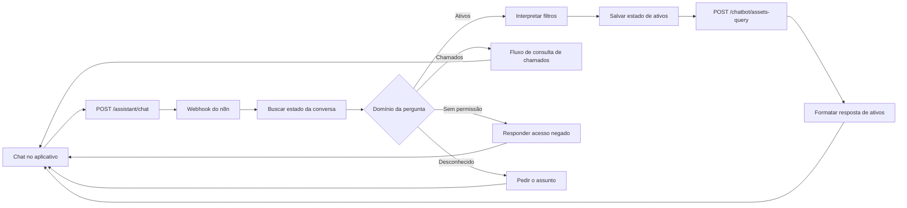

# Consulta de ativos no chat

O chat consulta a Central de Ativos pelo workflow ativo do n8n. A consulta cobre os inventários de **climatização, incêndio e água**. Perguntas sobre chamados continuam no fluxo anterior.

## Perguntas atendidas

- Totais: “Quantos ativos de climatização existem?”
- Listagens: “Liste 5 extintores da praça Natal.”
- Agrupamentos: “Quantos equipamentos existem por tipo?” ou “Quais as localizações dos ativos?”
- Rankings: “Quais lojas têm mais ativos de climatização?”
- Filtros: tipo de ativo, loja, praça, status, tipo de equipamento, local, marca, código, BPCS, SAP, capacidade em BTU e vencimento/troca de filtro até uma data.
- Continuação: “E na praça Natal?” ou “Quantos são no salão de venda?” mantém os filtros pertinentes da pergunta anterior.

O backend guarda na conversa o estado estruturado da última consulta de ativos. Em perguntas de continuação, o n8n mescla apenas os filtros alterados; perguntas novas substituem o estado. Assim o modelo recebe a pergunta atual e esse estado curto, sem o histórico inteiro no prompt de ativos. O roteamento usa termos de domínio normalizados antes de chamar o modelo: “ar condicionados” e “máquinas de ar condicionado” são perguntas de ativos, enquanto “chamados” segue o fluxo anterior.

No inventário, “salão de venda” corresponde aos locais cadastrados como “Salão” ou “Salão de Vendas”. Uma resposta de contagem com esse filtro informa os nomes dos locais efetivamente encontrados. Perguntas sobre **quais são as localizações** agrupam os ativos por local e removem o filtro anterior de local, preservando loja e tipo.

A listagem devolve no máximo 50 equipamentos por resposta. Agrupamentos e rankings devolvem no máximo 100 grupos. A API retorna o total e sinaliza quando houve corte. A consulta não aceita SQL livre nem modifica os cadastros.

## Autorização

O usuário precisa de `assistant.use` para falar no chat. Cada domínio exige a sua permissão: `assets.view` para ativos, `indicators.view` para chamados corretivos, preventivos e custos. O backend emite um comprovante assinado, válido por três minutos, **listando os domínios autorizados**; o n8n o encaminha à API usando a credencial `X-Internal-API-Key` já existente. Uma pergunta de domínio não autorizado recebe resposta de falta de permissão nomeando o domínio recusado.

Como os domínios entram no corpo assinado, adulterar a lista quebra o HMAC. Um comprovante do formato anterior, sem o campo de domínios, não autoriza nada.

## Estado da conversa

O estado estruturado vive na tabela `chat_query_state` do n8n, uma linha por sessão, com a coluna `domain` registrando o domínio do último turno. **O backend não carrega nem persiste estado de consulta**: a coluna `assistant_conversations.asset_query_state` foi removida pela migração 0008.

O roteamento usa dois eixos — entidade (custo, chamado, ativo) e qualificador (preventivo, corretivo) — com precedência declarada. Uma pergunta sem marcador nenhum permanece no domínio do turno anterior; sem domínio anterior, o chat responde que não identificou o assunto em vez de consultar chamados por padrão.

Ao trocar de domínio, só as dimensões compartilhadas sobrevivem (praça, loja, período, forma da consulta): um fornecedor de chamado não contamina um ranking de custo.

**Limitação do acompanhamento de ativos:** a linha de estado guarda `asset_type`, `location`, `praca`, `store_name` e a forma da consulta. Filtros como tipo de equipamento, código de loja, marca, capacidade e vencimento não têm coluna na tabela e por isso não sobrevivem ao turno seguinte — um acompanhamento mantém o tipo de ativo e o local, mas pode responder mais amplo que a pergunta anterior.

## Atualização do workflow

O workflow é armazenado no volume do n8n. O script [add_asset_query_branch.py](../n8n/add_asset_query_branch.py) cria ou atualiza a ramificação de ativos a partir de uma exportação do workflow. Ele copia as referências das credenciais existentes e não grava o valor da chave no JSON. A coluna `assistant_conversations.asset_query_state` é criada pela migração `0002` do backend.

1. Faça backup do workflow e das credenciais criptografadas do n8n.
2. Exporte **somente** o workflow de chat com `n8n export:workflow --id=ID --output=/tmp/chat.json`.
3. Execute `python n8n/add_asset_query_branch.py chat.json chat-com-ativos.json`.
4. Importe o JSON no projeto dono do workflow com `n8n import:workflow --input=chat-com-ativos.json --projectId=ID_DO_PROJETO`.
5. Publique com `n8n publish:workflow --id=ID` e reinicie o n8n para carregar a versão publicada.

O importador desativa o workflow durante a importação; a publicação e o reinício são parte da atualização. Confirme ao final que o workflow está ativo e que o nó **Consultar Ativos** usa a credencial de cabeçalho do backend. No ambiente local, a versão publicada foi validada com perguntas de total, lista, agrupamento, continuação, acesso negado e chamado.
